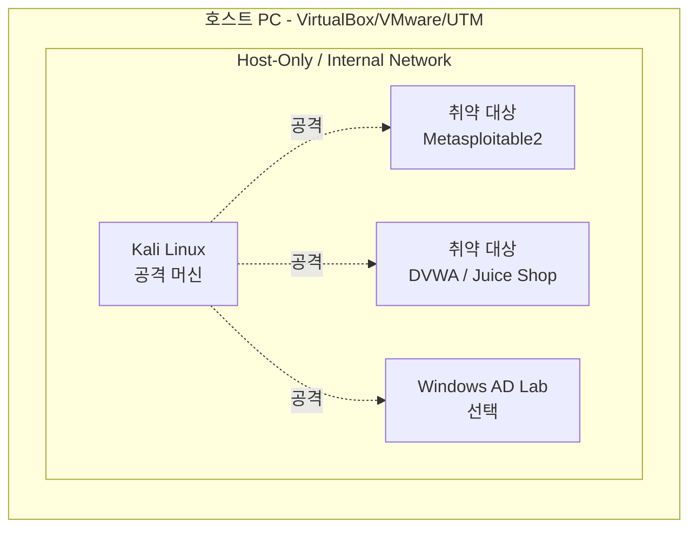

허가 없는 시스템 대신, **격리된 가상 랩**에서 무제한으로 연습한다. 핵심은
공격 머신과 취약 대상을 **인터넷·집 네트워크와 분리된 가상 네트워크**에 두는 것이다.

## 최소 구성 {#minimal-setup}

| 구성요소 | 추천 | 용도 |
|---|---|---|
| 하이퍼바이저 | VirtualBox(무료), VMware, UTM(Apple Silicon) | 가상머신 실행 |
| 공격 머신 | **Kali Linux** 또는 Parrot OS | 도구 모음 사전 탑재 |
| 취약 리눅스 | Metasploitable2, VulnHub 이미지 | 네트워크·서비스 공격 |
| 취약 웹앱 | DVWA, OWASP Juice Shop, WebGoat | 웹 취약점 |
| AD 실습 | Windows Server + 클라이언트, [GOAD](https://github.com/Orange-Cyberdefense/GOAD) | 도메인·측면이동 |

## 격리가 왜 중요한가 {#isolation}

- **NAT/Bridged 금지, Host-Only 또는 Internal 사용** — 취약 VM이 실수로 인터넷에 노출되면
  실제 봇넷에 감염될 수 있고, 스캔이 집 밖으로 새어나가면 법적 문제가 된다.
- **스냅샷**을 적극 활용한다. 익스플로잇 전 스냅샷 → 실패하면 롤백.
- 취약 VM에는 개인 데이터·자격증명을 절대 두지 않는다.

## 클라우드 대안 {#cloud}

로컬 리소스가 부족하면 **TryHackMe / Hack The Box**의 브라우저 기반 랩을
쓴다. 이미 격리·인가된 환경이므로 별도 설정 없이 바로 연습할 수 있다.
