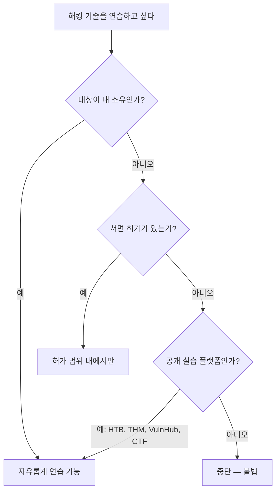

화이트해커(윤리적 해커)와 공격자를 가르는 것은 **기술이 아니라 허가(authorization)**다.
같은 도구, 같은 명령어라도 서면 허가 유무에 따라 하나는 직업이고 다른 하나는 범죄다.

## 절대 원칙 {#core-principles}

1. **명시적 서면 허가 없이는 아무것도 건드리지 않는다.** 구두 허가, "괜찮을 거야"는 허가가 아니다.
2. **범위(scope)를 벗어나지 않는다.** 허가받은 IP·도메인·계정 밖은 존재하지 않는 것처럼 취급한다.
3. **피해를 최소화한다.** 서비스 중단, 데이터 파괴, 실 사용자 영향이 예상되면 멈추고 보고한다.
4. **발견한 취약점은 책임 있게 공개한다.** 악용·판매·과시하지 않는다.
5. **알게 된 데이터는 비밀로 유지한다.** 고객 데이터는 테스트가 끝나면 안전하게 파기한다.

## 참여 규칙(Rules of Engagement) {#roe}

모든 정식 침투 테스트는 시작 전에 **RoE 문서**로 범위를 못박는다.

| 항목 | 내용 |
|---|---|
| 대상 범위 | 테스트 허용 IP 대역, 도메인, 애플리케이션 |
| 제외 대상 | 절대 건드리면 안 되는 시스템(운영 DB, 결제 등) |
| 허용 기법 | 소셜 엔지니어링·DoS·물리 침투 허용 여부 |
| 시간대 | 테스트 허용 시간(업무 영향 최소화) |
| 비상 연락 | 사고 발생 시 즉시 연락할 담당자 |
| 데이터 취급 | 추출 가능 데이터 범위와 파기 방법 |

## 법적 경계 (한국 기준) {#legal-kr}

- **정보통신망법 제48조** — 정당한 접근권한 없이 정보통신망에 침입하면 처벌.
- **형법 제347조의2 (컴퓨터등 사용사기), 제366조 (재물손괴)** — 데이터 훼손·부정 이용.
- **개인정보보호법** — 테스트 중 접근한 개인정보의 수집·이용·파기 의무.

허가서가 있어도 범위를 벗어나면 보호받지 못한다. **범위 = 방패**다.

## 공개 vs 사설, 어디서 연습하나 {#where-to-practice}

합법적 연습터: **Hack The Box, TryHackMe, VulnHub, PortSwigger Web Security Academy,
OWASP Juice Shop, DVWA**, 그리고 인가된 **버그바운티 프로그램**(HackerOne, Bugcrowd).
버그바운티도 각 프로그램의 정책·범위를 반드시 준수한다.

## 책임 있는 공개(Responsible Disclosure) {#disclosure}

1. 취약점을 발견하면 악용하지 않고 재현 최소한만 확인한다.
2. 해당 조직의 보안 연락처(security.txt, 버그바운티)로 조용히 신고한다.
3. 수정 기한(보통 90일)을 협의하고 그 전까지 공개하지 않는다.
4. 협의된 시점에만 공개하며, 실 피해자 데이터는 절대 노출하지 않는다.

---

> 🧪 **실습해 보기**: [실습 예제 문제](/docs/labs/) — 아래 모든 문제는 여기서 정한 인가·범위 원칙 위에서만 수행한다.
