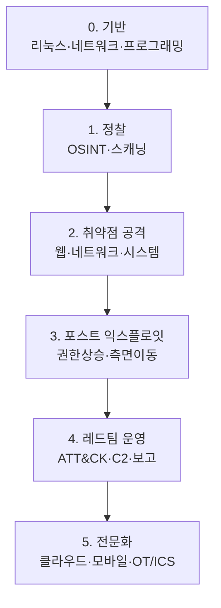

화이트해커 역량은 한 번에 완성되지 않는다. **기반기술 → 공격기술 → 실전운영**
순으로 쌓는다. 각 단계는 앞 단계를 전제로 한다.

## 성장 단계 {#stages}

## 단계별 체크리스트 {#checklist}

| 단계 | 반드시 갖출 것 | 검증 방법 |
|---|---|---|
| 0. 기반 | Linux CLI, TCP/IP, HTTP, Python/Bash 기초 | 스크립트로 간단한 스캐너 작성 |
| 1. 정찰 | nmap, OSINT, 서비스 열거 | THM 초급 방 클리어 |
| 2. 공격 | OWASP Top 10, Metasploit, 수동 익스플로잇 | Juice Shop 전 과제, HTB Easy 박스 |
| 3. 포스트 | 권한상승(Linux/Windows), 피벗팅 | HTB Medium 박스 |
| 4. 운영 | ATT&CK 매핑, C2 운용, 리포팅 | 랩에서 풀 체인 공격 후 보고서 작성 |
| 5. 전문화 | 관심 분야 심화(클라우드/모바일/AD) | 해당 분야 자격증·CTF |

## 조언 {#advice}

- **손으로 먼저, 자동화는 나중에.** Metasploit 원클릭보다 수동 익스플로잇을 먼저 이해한다.
- **막히면 write-up을 읽되, 답을 베끼지 말고 원리를 이해한 뒤 다시 스스로 푼다.**
- **문서화 습관.** 처음부터 발견 사항을 기록하면 4단계 보고서 작성이 쉬워진다.
- 자격증·진로는 [도구 & 커리어](/docs/resources/certifications-career/) 참고.

---

> 🧪 **실습해 보기**: [실습 예제 문제](/docs/labs/) — 각 단계를 마칠 때마다 대응하는 실습으로 손에 익힌다.
