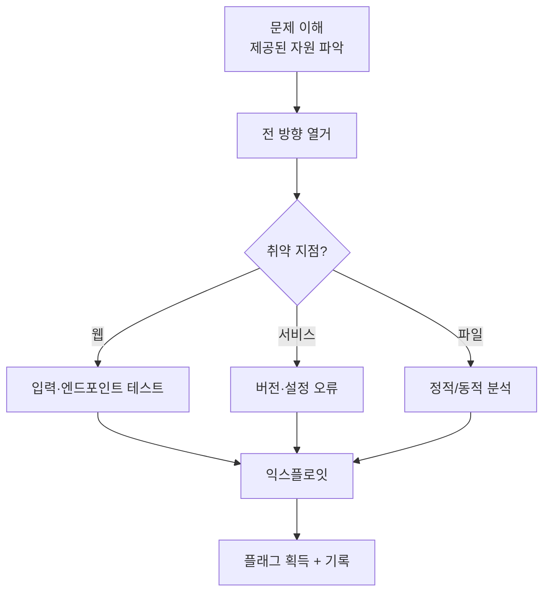

CTF(Capture The Flag)는 숨겨진 플래그를 찾는 실전형 문제 풀이다. 정찰부터
익스플로잇까지 여러 기법을 창의적으로 결합하는 능력을 기른다.

## CTF 유형 {#types}

| 유형 | 내용 |
|---|---|
| Web | 웹 취약점 익스플로잇 |
| Pwn(바이너리) | 메모리 손상·익스플로잇 개발 |
| Reversing | 바이너리 역공학 |
| Crypto | 암호 취약점 |
| Forensics | 디스크·메모리·패킷 분석 |
| Boot2Root | 머신 하나를 root까지 |

## 접근 전략 {#strategy}



## 자가 점검 문제 {#self-check}

개념이 잡혔는지 스스로 확인한다.

**Q1.** nmap에서 전체 포트를 빠르게 스캔한 뒤, 발견된 포트만 정밀 스캔하는
2단계 명령을 써 보라. 🟢

<details><summary>정답</summary>

```bash
sudo nmap -p- --min-rate 2000 <t> -oN a.txt
sudo nmap -sV -sC -p <ports> <t>
```
</details>

**Q2.** 저장형 XSS와 반사형 XSS의 차이와, 각각의 전달(delivery) 방식을 설명하라. 🟢

<details><summary>정답</summary>

저장형은 페이로드가 서버에 **저장**되어 방문자마다 실행(전달: 그냥 방문).
반사형은 요청에 실린 값이 **즉시 응답에 반사**되어 실행(전달: 악성 링크 클릭 유도).
</details>

**Q3.** 낮은 권한 셸에서 리눅스 권한상승 벡터를 3가지 이상 나열하고, 각각의
확인 명령을 써 보라. 🟡

<details><summary>정답</summary>

sudo 오설정(`sudo -l`), SUID(`find / -perm -4000 2>/dev/null`),
쓰기 가능 크론/PATH(`cat /etc/crontab`), 취약 커널(`uname -a`),
노출된 자격증명(설정파일·히스토리). GTFOBins로 악용 방법 확인.
</details>

**Q4.** 레드팀 교전에서 발견을 보고서의 "발견 사항" 항목으로 정리할 때
반드시 포함해야 할 5가지 요소는? 🟡

<details><summary>정답</summary>

제목·심각도(CVSS), 설명, 영향(Impact), 재현 절차(PoC), 개선 방안(Remediation).
참고: [보고서 작성](/docs/redteam/reporting/)
</details>

## 추천 CTF 플랫폼 {#platforms}

- **picoCTF** — 입문 친화적, 상시 오픈.
- **Hack The Box / TryHackMe** — Boot2Root, 상시 랩.
- **CTFtime.org** — 전 세계 CTF 대회 일정.
- **OverTheWire (Bandit)** — 리눅스·기초 훈련.
