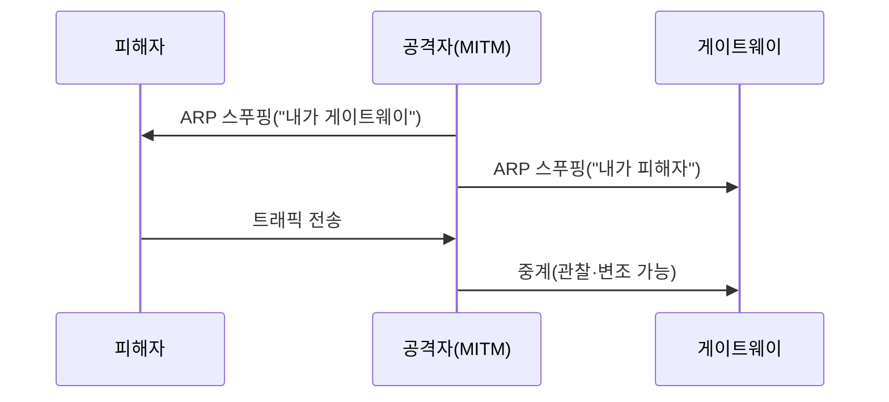

같은 네트워크 세그먼트에서는 트래픽을 관찰·조작할 수 있다. 무선은 물리 매체가
공유되므로 특히 취약하다. **반드시 본인 소유·인가된 네트워크에서만** 실습한다.

## 패킷 스니핑 {#sniffing}

- **Wireshark** — 패킷 캡처·분석. 평문 프로토콜(HTTP, FTP, Telnet)에서 자격증명 관찰.
- **tcpdump** — CLI 캡처.

```bash
sudo tcpdump -i eth0 -w capture.pcap port 80
```

## 중간자 공격(MITM) {#mitm}



ARP 스푸핑으로 트래픽을 자신을 거치게 만든다. **방어**: 동적 ARP 검사(DAI),
HTTPS/HSTS(평문 노출 방지), 포트 보안.

## 무선(Wi-Fi) 평가 {#wireless}

| 단계 | 도구 |
|---|---|
| 모니터 모드 전환 | `airmon-ng start wlan0` |
| AP·클라이언트 탐색 | `airodump-ng` |
| WPA 핸드셰이크 캡처 | `airodump-ng` + 디어스 |
| 오프라인 크랙 | `aircrack-ng`, hashcat |

```bash
# 인가된 본인 AP에 대해서만
airmon-ng start wlan0
airodump-ng wlan0mon
# 핸드셰이크 캡처 후
aircrack-ng -w rockyou.txt -b <BSSID> capture.cap
```

**방어**: WPA3 또는 강력한 WPA2 패스프레이즈, WPS 비활성화, 게스트망 분리.
