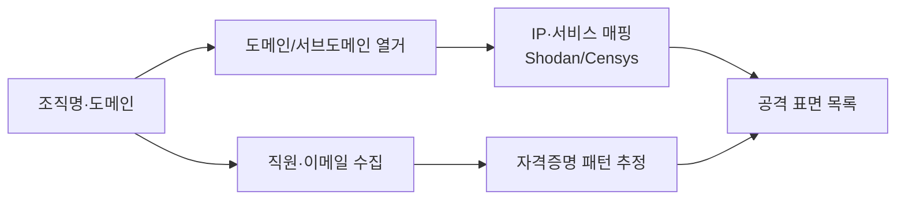

OSINT(Open-Source Intelligence)는 **대상 시스템에 직접 접근하지 않고** 공개
정보만으로 조직의 자산·직원·기술스택을 파악하는 수동 정찰이다. 흔적을 남기지 않는다.

## 무엇을 찾나 {#targets}

| 자산 유형 | 출처·도구 |
|---|---|
| 도메인·서브도메인 | `crt.sh`, Subfinder, Amass, DNSdumpster |
| IP·인프라 | Shodan, Censys, ASN 조회 |
| 이메일·직원 | Hunter.io, LinkedIn, theHarvester |
| 코드·비밀 유출 | GitHub 검색, gitleaks, TruffleHog |
| 기술 스택 | Wappalyzer, BuiltWith, HTTP 헤더 |
| 유출 자격증명 | Have I Been Pwned(방어 목적 확인) |

## 워크플로우 {#workflow}



## 실습 예시 {#examples}

서브도메인 열거(본인 소유 도메인 또는 인가 대상만):

```bash
# 인증서 투명성 로그에서 서브도메인 수집
curl -s "https://crt.sh/?q=%25.example.com&output=json" | jq -r '.[].name_value' | sort -u

# theHarvester로 이메일·호스트 수집
theHarvester -d example.com -b bing,crtsh
```

## 방어 관점 {#defense}

OSINT로 노출되는 것은 곧 공격자에게 노출되는 것이다. 방어팀은 **공개된 자산 최소화**,
**GitHub 비밀 스캔**, **직원 SNS 보안 인식 교육**으로 표면을 줄인다.

---

> 🧪 **실습해 보기**: [네트워크·시스템 실습 문제](/docs/labs/network-system-challenges/) — 수집한 정보를 능동 스캐닝으로 검증한다.
