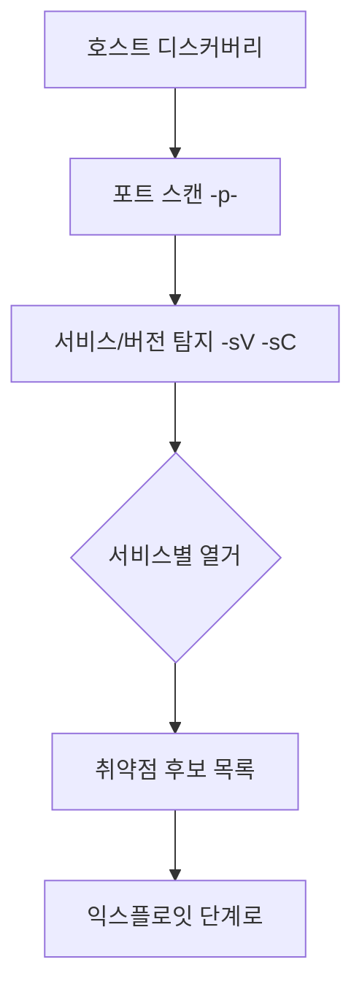

능동 정찰은 대상에 **직접 패킷을 보내** 살아있는 호스트, 열린 포트, 서비스
버전을 식별한다. 트래픽이 남으므로 **반드시 인가된 범위에서만** 수행한다.

## nmap 핵심 {#nmap}

```bash
# 호스트 디스커버리(핑 스윕)
nmap -sn 10.10.10.0/24

# 기본 SYN 스캔 + 서비스/버전 + 기본 스크립트
sudo nmap -sS -sV -sC -O 10.10.10.5

# 전체 포트(느림), 그다음 발견된 포트만 정밀 스캔
sudo nmap -p- --min-rate 2000 10.10.10.5 -oN allports.txt
sudo nmap -sV -sC -p 22,80,443,3306 10.10.10.5
```

| 옵션 | 의미 |
|---|---|
| `-sS` | SYN(스텔스) 스캔 |
| `-sV` | 서비스/버전 탐지 |
| `-sC` | 기본 NSE 스크립트 |
| `-p-` | 전체 65535 포트 |
| `-O` | OS 핑거프린팅 |
| `-oA base` | 모든 포맷으로 결과 저장 |

## 열거(Enumeration) {#enum}

포트를 찾았으면 서비스별로 깊이 판다. 발견된 서비스 → 대응 도구:

| 포트/서비스 | 열거 도구 |
|---|---|
| 80/443 HTTP | gobuster, ffuf, nikto, whatweb |
| 445 SMB | enum4linux-ng, smbclient, crackmapexec |
| 21 FTP | 익명 로그인 확인, ftp |
| 25 SMTP | 사용자 열거(VRFY) |
| 3306/5432 DB | 기본 자격증명, 버전 취약점 |

```bash
# 웹 디렉터리 퍼징
ffuf -u http://10.10.10.5/FUZZ -w /usr/share/wordlists/dirb/common.txt -mc 200,301,302

# SMB 열거
enum4linux-ng -A 10.10.10.5
```

## 스캐닝 흐름 {#flow}



---

> 🧪 **실습해 보기**: [문제 1 — 열린 문 찾기](/docs/labs/network-system-challenges/#c1-scan) — 전체 포트 스캔과 서비스 열거를 직접 수행한다.
