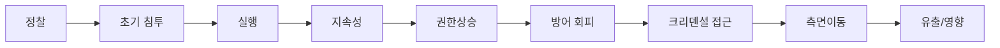

레드팀 vs 펜테스트의 차이는 **목표**다. 펜테스트는 최대한 많은 취약점을 찾고,
레드팀은 특정 목표(예: 도메인 관리자·특정 데이터)를 향해 **실제 공격자처럼**
은밀하게 움직이며 방어팀(블루팀)의 탐지 역량을 시험한다.

## MITRE ATT&CK {#attack}

ATT&CK은 공격자의 전술(Tactic, "왜")과 기법(Technique, "어떻게")을 정리한
지식베이스다. 레드팀은 작전을 ATT&CK 기법에 매핑해 커버리지와 탐지를 측정한다.

| 전술(예) | 기법 예시 |
|---|---|
| Initial Access | 스피어피싱(T1566) |
| Execution | 파워셸(T1059.001) |
| Persistence | 스케줄 작업(T1053) |
| Defense Evasion | 난독화·서명(T1027) |
| Credential Access | LSASS 덤프(T1003) |
| Lateral Movement | Pass-the-Hash(T1550.002) |

## 에뮬레이션 계획 {#plan}

1. **위협 선정** — 조직이 실제로 마주할 행위자(APT 그룹 등)를 정한다.
2. **TTP 추출** — 해당 그룹의 알려진 기법을 ATT&CK에서 뽑는다.
3. **시나리오 실행** — 초기 침투부터 목표까지 체인으로 수행한다.
4. **탐지 측정** — 각 단계에서 블루팀이 탐지·차단했는지 기록한다.

## Purple Team {#purple}

레드팀 실행과 블루팀 탐지를 **협업**으로 진행하면(퍼플팀) 탐지 규칙을 즉시
개선할 수 있다. Atomic Red Team, Caldera로 개별 기법을 재현·검증한다.
