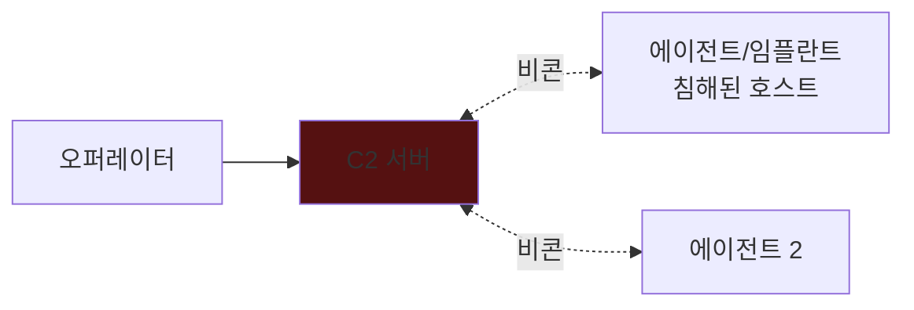

대부분의 실제 침해는 기술 취약점이 아니라 **사람**에서 시작한다. 레드팀은
소셜 엔지니어링으로 초기 발판을 얻고, **C2(Command & Control)**로 침해 자산을 운용한다.

## 소셜 엔지니어링 {#se}

| 기법 | 설명 |
|---|---|
| 피싱/스피어피싱 | 표적화된 악성 이메일 |
| 프리텍스팅 | 신뢰할 만한 상황·정체 위장 |
| 베이팅 | USB·미끼로 실행 유도 |
| Vishing | 전화로 정보·행동 유도 |

**RoE 필수**: 소셜 엔지니어링은 직원 대상 실험이므로 반드시 사전 승인·범위·
심리적 안전장치를 명시한다. 실제 개인 피해를 주지 않는다.

## C2 개념 {#c2}

C2는 침해 호스트의 **에이전트(임플란트)**와 오퍼레이터를 잇는다. 에이전트는
주기적으로 서버에 접속(beacon)해 명령을 받고 결과를 반환한다.

| 프레임워크 | 특징 |
|---|---|
| Cobalt Strike | 상용 표준(레드팀) |
| Sliver | 오픈소스, 크로스플랫폼 |
| Mythic | 모듈형, 멀티 에이전트 |
| Metasploit | 학습·기본 기능 |

## 탐지 회피와 그 한계 {#evasion}

레드팀은 EDR 탐지를 우회하는 기법(도메인 프론팅, 지터, 트래픽 위장)을 쓴다.
목적은 **방어 성능을 정직하게 측정**하는 것이지, 실제 시스템에 피해를 남기는 것이 아니다.
모든 인프라·페이로드는 교전 종료 시 폐기하고 보고서에 명시한다.

---

> 🧪 **실습해 보기**: [CTF 종합 문제](/docs/labs/ctf-comprehensive/) — Boot2Root 유형으로 초기 침투부터 장악까지 연습한다.
