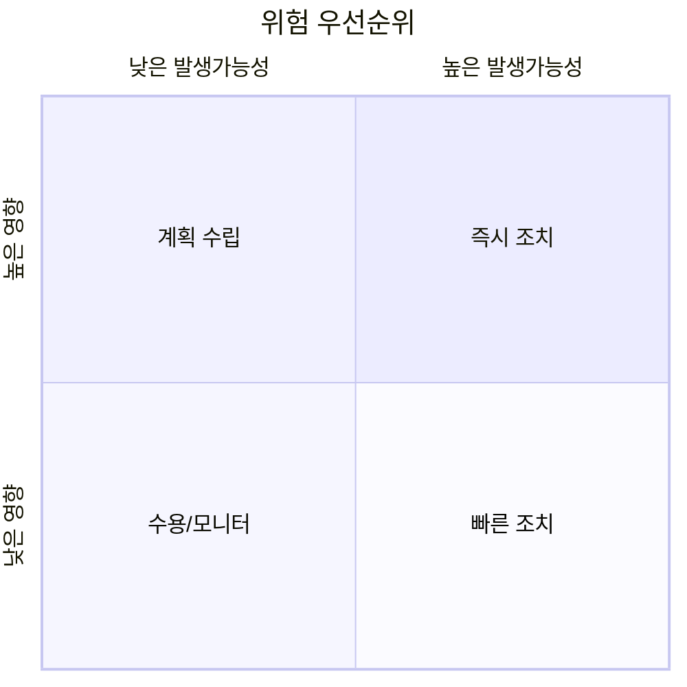

보고서 없는 침투 테스트는 무의미하다. 고객이 돈을 내는 것은 셸이 아니라
**우선순위가 매겨진, 실행 가능한 방어 계획**이다. 실력 있는 해커와 뛰어난
컨설턴트를 가르는 지점이 여기다.

## 구성 {#structure}

| 섹션 | 대상 독자 | 내용 |
|---|---|---|
| Executive Summary | 경영진 | 비즈니스 위험, 전반 평가(기술용어 최소) |
| 범위·방법론 | 관리자 | RoE, 테스트 기간·대상·기법 |
| 발견 사항 | 엔지니어 | 취약점별 상세 |
| 부록 | 엔지니어 | 로그·페이로드·ATT&CK 매핑 |

## 발견 사항 항목 {#finding}

각 취약점은 다음을 포함한다:

1. **제목·심각도** — CVSS 점수와 위험 등급.
2. **설명** — 무엇이 왜 취약한가.
3. **영향(Impact)** — 악용 시 비즈니스 관점 결과.
4. **재현 절차(PoC)** — 스크린샷·명령어로 단계별.
5. **개선 방안(Remediation)** — 구체적·실행 가능한 수정.

## 위험 등급 {#risk}

## 좋은 보고서의 원칙 {#principles}

- **재현 가능해야** 한다 — 개발자가 그대로 따라 확인할 수 있어야 한다.
- **비난이 아니라 해결**에 초점. 조직을 돕는 문서다.
- **우선순위**를 명확히 — 무엇을 먼저 고쳐야 하는지.
- 심각한 발견은 테스트 중이라도 **즉시 구두 보고**한다(RoE의 비상 연락).

---

> 🧪 **실습해 보기**: [CTF 자가 점검 Q4](/docs/labs/ctf-comprehensive/#self-check) — 발견 사항 보고서 5요소를 스스로 점검한다.
