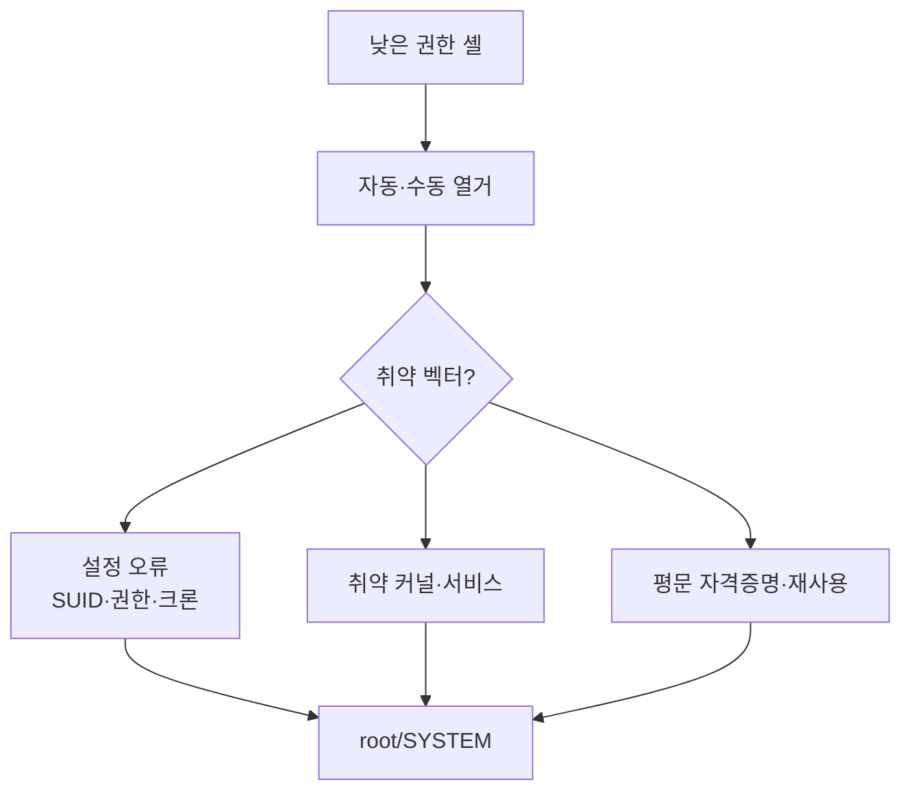

권한 상승(privilege escalation)은 제한된 계정에서 관리자 권한을 획득하는 과정이다.
핵심은 **열거**다 — 시스템을 샅샅이 조사해 잘못된 설정을 찾는다.

## 공통 원리 {#principle}



## Linux 권한상승 {#linux}

| 벡터 | 확인 |
|---|---|
| sudo 오설정 | `sudo -l` → [GTFOBins](https://gtfobins.github.io) |
| SUID 바이너리 | `find / -perm -4000 2>/dev/null` |
| 쓰기 가능 크론·경로 | `/etc/crontab`, PATH 하이재킹 |
| 취약 커널 | `uname -a` → 알려진 exploit |
| 자격증명 노출 | 설정파일·히스토리·`.env` |

자동 열거: **linpeas.sh**, LinEnum.

```bash
sudo -l                              # sudo 권한 확인
find / -perm -4000 -type f 2>/dev/null   # SUID 탐색
./linpeas.sh | tee linpeas.txt
```

## Windows 권한상승 {#windows}

| 벡터 | 도구 |
|---|---|
| 서비스 오설정(경로·권한) | winPEAS, PowerUp |
| 토큰 임퍼소네이션 | Potato 계열(SeImpersonate) |
| 저장된 자격증명 | `cmdkey /list`, 레지스트리 |
| AlwaysInstallElevated | 정책 오설정 |

자동 열거: **winPEAS.exe**, PowerUp.ps1, Seatbelt.

## 습관 {#habits}

- **한 번에 하나씩** 벡터를 검증하고 기록한다.
- 자동 도구 결과를 맹신하지 말고 수동으로 재확인한다.
- 얻은 자격증명은 [측면이동](/docs/system/persistence-lateral/)의 재료가 된다.
