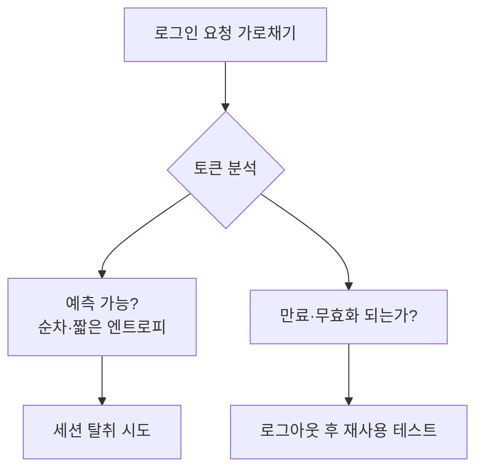

인증(누구인가)과 세션(로그인 상태 유지), 인가(무엇을 할 수 있나)의 결함은
전체 계정 탈취로 이어진다. OWASP A01·A07에 해당한다.

## 흔한 결함 {#flaws}

| 결함 | 공격 |
|---|---|
| 약한 비밀번호 정책 | 사전·무차별 대입(hydra, medusa) |
| 계정 열거 | 로그인 실패 메시지 차이로 유효 ID 판별 |
| 자격증명 스터핑 | 유출된 ID/PW 재사용 |
| 취약한 세션 토큰 | 예측 가능·미만료 세션 |
| MFA 부재 | 비밀번호만으로 침입 |

## IDOR / 접근통제 우회 {#idor}

**IDOR(Insecure Direct Object Reference)**는 A01의 대표 사례다. 요청의 식별자만
바꿔 남의 리소스에 접근한다.

```http
GET /api/invoice/1001   ← 내 것
GET /api/invoice/1002   ← 남의 것도 그냥 열림 = IDOR
```

서버가 "이 사용자가 이 객체에 접근할 권한이 있는가"를 검증하지 않아 생긴다.
Burp의 리피터로 식별자를 순회하며 확인한다(인가된 대상만).

## 세션 공격 흐름 {#flow}



## 무차별 대입 예시 {#brute}

```bash
# 인가된 실습 대상 로그인 폼에 대해서만
hydra -l admin -P rockyou.txt target http-post-form \
  "/login:user=^USER^&pass=^PASS^:Invalid"
```

## 방어 {#defense}

- 강력한 해시(bcrypt/argon2), 계정 잠금·레이트 리밋, **MFA**.
- 서버 측 접근통제(객체마다 소유자 검증), 세션 토큰은 충분한 엔트로피·만료·로그아웃 무효화.
- 로그인 성공/실패 메시지를 동일하게 하여 계정 열거 방지.
