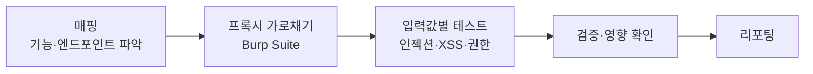

OWASP Top 10은 웹 애플리케이션의 가장 심각한 보안 위험을 정리한 사실상의
표준이다(2021년판 기준). 화이트해커의 웹 테스트 체크리스트로 쓴다.

## Top 10 (2021) {#list}

| # | 범주 | 핵심 |
|---|---|---|
| A01 | 접근 통제 취약(Broken Access Control) | 권한 밖 리소스 접근(IDOR 등) |
| A02 | 암호화 실패(Cryptographic Failures) | 민감정보 평문·약한 암호화 |
| A03 | 인젝션(Injection) | SQLi, 명령어 주입, LDAP 등 |
| A04 | 안전하지 않은 설계(Insecure Design) | 설계 단계의 결함 |
| A05 | 보안 설정 오류(Security Misconfiguration) | 기본 계정, 노출된 관리 페이지 |
| A06 | 취약·구식 컴포넌트 | 오래된 라이브러리·CVE |
| A07 | 인증·식별 실패 | 약한 인증, 세션 관리 |
| A08 | 소프트웨어·데이터 무결성 실패 | 검증 없는 역직렬화·업데이트 |
| A09 | 로깅·모니터링 실패 | 탐지 불가능한 침해 |
| A10 | SSRF | 서버가 공격자 지정 URL로 요청 |

## 웹 테스트 흐름 {#flow}

## 필수 도구 {#tools}

- **Burp Suite** — HTTP 프록시. 요청 가로채기·변조·리피터·인트루더. 웹 해킹의 중심.
- **OWASP ZAP** — 무료 대안.
- **브라우저 개발자도구** — 요청·쿠키·스토리지 확인.

다음 페이지들에서 A03(인젝션), XSS/CSRF, A07(인증/세션)을 실습한다.

---

> 🧪 **실습해 보기**: [웹 해킹 실습 문제](/docs/labs/web-challenges/) — Top 10 항목을 Juice Shop·DVWA에서 실제로 익스플로잇한다.
